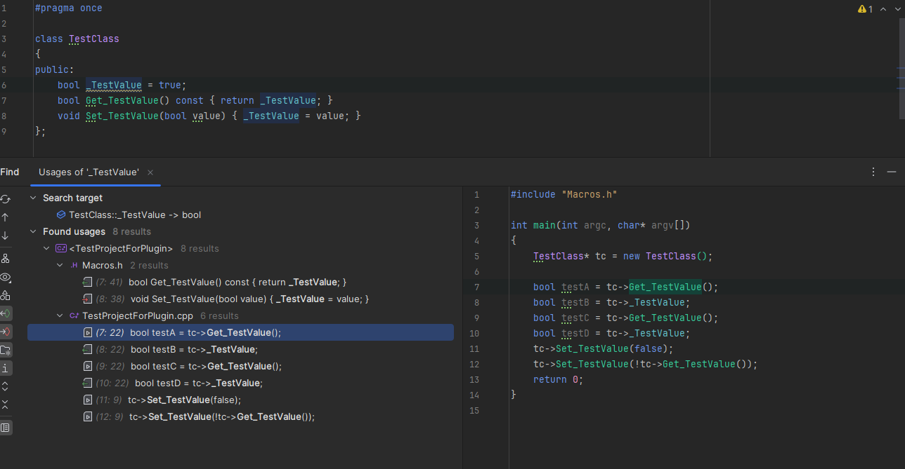
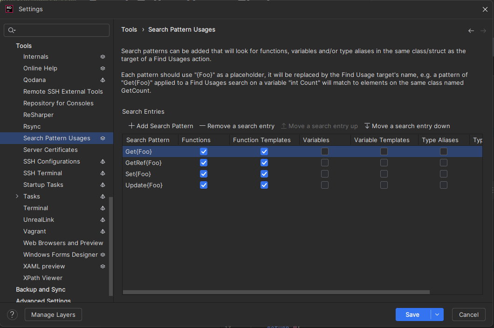
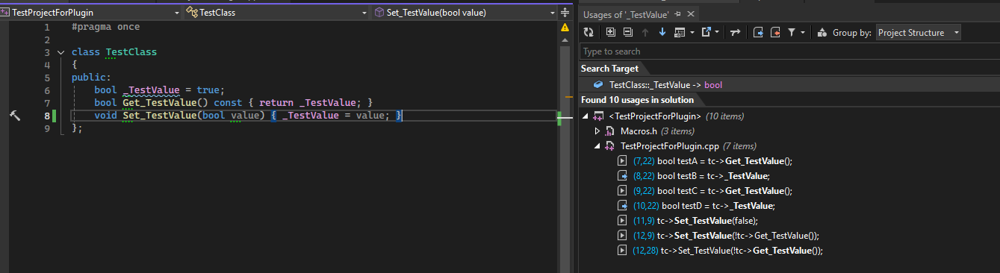

# Search Pattern Usages Plugin

Search Pattern Usages is a plugin for ReSharper and Rider that adds the ability to use configurable search patterns to add results to Find Usages actions in C++ projects.

Primarily intended for dealing with macro generated functions, which cannot easily have the Find Usages action performed on them, it will allow you to write custom patterns to match the generated functions' signatures in your project.

A good example is if you generate Get and Set functions automatically, you can set up rules to check for functions or function templates with the names generated by your functions.

This is a very small and simple tool, feel free to submit any and all feature pull requests.

Rider Example & Options:

ReSharper Example & Options:

